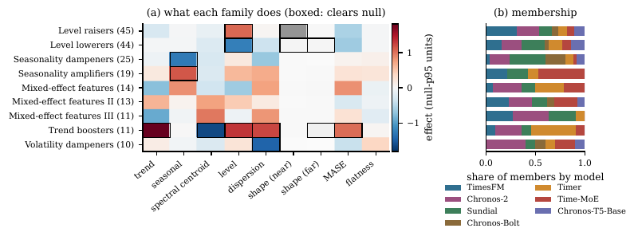

# TSFM-Lens

[](https://github.com/DanK10097110/TSFM-Interp/actions/workflows/ci.yml)
[](LICENSE)
[](https://dank10097110.github.io/TSFM-Interp/)
[](https://colab.research.google.com/github/DanK10097110/TSFM-Interp/blob/main/examples/quickstart.ipynb)

**TSFM-Lens** is a mechanistic-interpretability toolkit for time-series
foundation models (TSFMs). It compares architecturally different models —
TimesFM (decoder-only), the Chronos family (encoder-decoder and
encoder-only), Sundial (flow-matching), Lag-Llama, and any Hugging Face
checkpoint via a zero-code probe path — on equal footing, using a
leakage-audited synthetic benchmark, a layered representational/causal
analysis stack, and statistically-corrected cross-architecture comparison.
The usability model is inspired by `transformer-lens`, but the tool itself is
comparative by design: aligned representations across models, series-level
bootstrap statistics, and a one-shot confirmation on a sealed held-out
corpus, not a single-model microscope.

**Try it:** [live example report](https://dank10097110.github.io/TSFM-Interp/) (seven models, with its held-out
confirmation) · [Colab quickstart](https://colab.research.google.com/github/DanK10097110/TSFM-Interp/blob/main/examples/quickstart.ipynb)
(two real models, about 25 minutes on one GPU) · [`docs/QUICKSTART.md`](docs/QUICKSTART.md)

**What it found on seven TSFMs** (TimesFM, Chronos-2, Sundial, Chronos-Bolt, Chronos-T5, Timer, Time-MoE). Every
claim below was registered on a development corpus and tested once on a fresh sealed private corpus of 971 series:
- **Shared inputs.** Different architectures select the same series for a concept: 20/20 concept-transfer claims
  confirm, on four independent private draws, reaching all seven models.
- **Model-specific machinery.** No causal concept spans more than three of the seven models, and the concept atlas is
  organized by model.
- **A compact causal vocabulary.** Causal features act mainly on forecast level and seasonality; 10 single-feature
  causal claims confirm at the attainable significance floor.
- **Prominence is not importance.** 83.5% of the most prominent SAE features have no causal effect on the forecast.



See [`FINDINGS.md`](FINDINGS.md) (SH-18, SH-16, CA-11, MN-14) for exact numbers, including the claims that did not
confirm.

## What it answers

- What interpretable concepts does a TSFM actually learn — as **causal**
  features (a sparse-autoencoder feature an ablation battery confirms
  actually moves the forecast), not just activations that happen to
  correlate with something?
- Are those concepts **shared** across architecturally different models, or
  does each model learn something unique? The **concept atlas** clusters each
  model's causal features into concept families, then tests every family for
  transfer to every other model. That turns "these representations look
  similar" into a tested claim that two models select the same inputs. The
  claim is correlational, and the held-out results above show where it stops.
- Do the concepts **causally** affect the forecast, or are they merely
  correlated with it?
- **Where in depth** does a model's forecast take shape?
- Which model is better, on which kinds of data, and at what compute cost?

## Two packages

```
.
├── tsfm_benchmark/      # generation + validation of a synthetic benchmark corpus
│   ├── build_pipeline/       # generators, corruptions, leakage audit, sealing
│   ├── benchmark_validation/ # redundancy + catch22 diversity report
│   ├── example_runs/         # CLI entry points + a walkthrough
│   └── configs/
└── tsfm_lens/          # the interpretability pipeline ("tsfm-lens")
    ├── tsfm_lens/             # the package: models, extraction, analysis, report
    ├── docs/                  # adapter guide, worked example, notebooks
    ├── configs/               # run configs, including configs/examples/
    └── run.py                 # CLI entry point
```

They are separately installable on purpose (see [Install](#install)) and
their dependency sets barely overlap: `tsfm_benchmark` is CPU-only
(numpy/scipy/pyyaml); `tsfm_lens` needs torch, zarr, and plotly, plus
optional model-loading libraries for real checkpoints.

## Quickstart

```bash
# 1. Build a small synthetic benchmark corpus (fast, no GPU, no downloads)
cd tsfm_benchmark
PYTHONPATH=. python3 example_runs/run_full.py --config configs/example.yaml \
    --out ./benchmark_out --max-count 15

# 2. Validate it (redundancy + catch22 feature-space diversity)
PYTHONPATH=. python3 example_runs/run_validation.py \
    --corpus ./benchmark_out/public_dev --out outputs

# 3. Run the tsfm-lens smoke pipeline (two mock architectures, CPU-only, ~30s)
cd ../tsfm_lens
python run.py --config configs/smoke.yaml
# open runs/smoke/report.html in a browser
```

Every command above was run against this checkout. Step 3 exercises the full
19-stage pipeline — extraction, behavioral comparison, representational
geometry, causal patching, attention analysis, activation clustering, and a
one-shot confirmation on a (smoke-mode) held-out split — against synthetic
mock architectures, so it needs no GPU and no model download. To run it
against a real checkpoint, point `data.path` at a sealed corpus from step 1
and swap in a real adapter (see
[`tsfm_lens/configs/examples/short_1model.yaml`](tsfm_lens/configs/examples/short_1model.yaml)
and [`tsfm_lens/docs/ADDING_A_MODEL.md`](tsfm_lens/docs/ADDING_A_MODEL.md)).

The smoke config skips the flagship analysis for speed: on a real multi-model
run (see
[`tsfm_lens/configs/examples/medium_2model.yaml`](tsfm_lens/configs/examples/medium_2model.yaml)
or `large_4model.yaml`), the `sae` and `concepts` stages train a sparse
autoencoder per model/layer, find which features are **causal** via an
ablation battery, cluster each model's causal features into **concept
families**, and test every family for **cross-model transfer** — the concept
atlas described in [`tsfm_lens/README.md`](tsfm_lens/README.md#concepts)
(see also [`#sae`](tsfm_lens/README.md#sae)).

**A first run on real models:** [`docs/QUICKSTART.md`](docs/QUICKSTART.md) and
[`examples/quickstart.ipynb`](examples/quickstart.ipynb) run Chronos-Bolt-small against Chronos-2 on a
400-series synthetic corpus. That takes about 25 minutes on one GPU and ends in a full report, without held-out
confirmation.

**See a real run before running one:**
[`examples/panel7_v2/`](examples/panel7_v2/) holds the seven-model run (TimesFM, Chronos-2, Sundial, Chronos-Bolt,
Timer, Time-MoE, Chronos-T5-Base) and its one-shot held-out confirmation, and
[`examples/concept_atlas_v2/`](examples/concept_atlas_v2/) holds the earlier
four-model run (TimesFM, Chronos-2, Sundial, Chronos-Bolt). It contains the
interactive `report.html`, the per-stage artifacts it was built from, the
exact config, and a write-up of what the run found and which results held up
on the sealed held-out split. For a section-by-section reading of a report,
see [`tsfm_lens/docs/worked_example.md`](tsfm_lens/docs/worked_example.md).

## Install

Two separate installable packages, not an in-progress merge — install
whichever half you need, or both, into one shared environment:

```bash
# tsfm_benchmark + benchmark_validation + example_runs (root pyproject.toml)
pip install -e .

# tsfm_lens (separate pyproject.toml, one level down)
pip install -e tsfm_lens
```

See [`DEPENDENCIES.md`](DEPENDENCIES.md) for the exact, verified-working
library versions and the load-bearing version pins (each one exists because
a looser bound broke in a documented way — `zarr<3`, `datasets<3`,
`tsbootstrap>=0.7`'s rewritten API, and others).

## Model support

Every adapter's tier, capabilities, and default checkpoint are generated
from the live registry in
[`tsfm_lens/ADAPTERS.md`](tsfm_lens/tsfm_lens/ADAPTERS.md) — this table is the
narrative summary:

| Model | Architecture | Determinism | What's captured |
|---|---|---|---|
| TimesFM 2.5 | Decoder-only, 32-step patch tokens | Deterministic | The whole captured stack does both context-reading and generation |
| Chronos-T5 | T5 encoder-decoder, 1 token/timestep | Sampled decoder | Only the **encoder** — the decoder is not captured, so depth claims are claims about the encoder |
| Chronos-Bolt | Encoder + patch regression head | Deterministic | Encoder + head |
| Chronos-2 | Encoder-only, adds cross-series GROUP attention (out of scope) | Deterministic | Encoder |
| Sundial | Decoder-only, flow-matching head | Sampled | Full captured stack |
| Lag-Llama | Decoder-only (contrib adapter) | Sampled (StudentT head) | Full captured stack |
| `generic_hf` (zero-code) | Whatever the checkpoint is — probed, not hand-declared | Depends on checkpoint | Verified live on Timer (`thuml/timer-base-84m`) |
| `mock_*` | Synthetic patch/step/encoder-decoder/wave architectures | Deterministic | Used for the CPU-only smoke pipeline and adapter-conformance tests |

Adding a new checkpoint starts with the zero-code `generic_hf` probe path
before any adapter code is written — see
[`tsfm_lens/docs/ADDING_A_MODEL.md`](tsfm_lens/docs/ADDING_A_MODEL.md).

## The evidence-class ladder

No single measurement supports the claim "these two models share structure."
Every finding in a report states which rung it stands on, so a
correlational number can never be misread as causal:

1. **Descriptive** — a per-model profile (effective dimensionality, family
   decodability) with no cross-model comparison at all.
2. **L1 — geometric.** Do two models' representations of the same data look
   similar (linear CKA)? Correlational: both models seeing the same input is
   enough to inflate this on its own.
3. **L2 — linear-translatable.** Can a linear map from one model's layer
   predict another's, **beyond** what a hand-built input-feature baseline
   already explains? Still not causal.
4. **L3 — causal, within-model.** Does patching a model's own clean
   activations back into a corrupted forward pass restore the forecast?
   Causal, but never transplanted between models — cross-model comparison is
   always two separately-measured within-model curves placed side by side.
5. **Illustrative** — a hand-picked exemplar case study: real, but not a
   statistical claim.
6. **Confirmed** — a dev-corpus hypothesis, pre-registered, then re-tested
   exactly once against a sealed private corpus. The gold standard.

## Documentation

| Doc | What's in it |
|---|---|
| [`docs/QUICKSTART.md`](docs/QUICKSTART.md), [`examples/quickstart.ipynb`](examples/quickstart.ipynb) | A first real two-model run in about 25 minutes on one GPU (Colab-ready) |
| [`examples/panel7_v2/`](examples/panel7_v2/) | The seven-model run with its held-out confirmation: report, artifacts, config, write-up |
| [`examples/concept_atlas_v2/`](examples/concept_atlas_v2/) | The earlier four-model run: report, per-stage artifacts, config and findings write-up |
| [`docs/RELEASING.md`](docs/RELEASING.md) | How a release is cut (PyPI trusted publishing, Zenodo DOI) |
| [`tsfm_lens/README.md`](tsfm_lens/README.md#sharing-and-disk-usage) | Sharing a run without multi-GB transfers (`--bundle`) and reclaiming disk (`--prune`) |
| [`FINDINGS.md`](FINDINGS.md) | The curated results ledger: every result so far, with exact numbers, evidence class and a 1–5 score (its `ROADMAP.md` references live on `dev`) |
| [`tsfm_benchmark/README.md`](tsfm_benchmark/README.md) | Leakage tiers, generators, archetypes, the audit, sealing/epochs, CLI |
| [`tsfm_benchmark/configs/README.md`](tsfm_benchmark/configs/README.md) | Every config on `main`, what it builds, and how to add a real-data source |
| [`tsfm_benchmark/example_runs/WALKTHROUGH.md`](tsfm_benchmark/example_runs/WALKTHROUGH.md) | Command-by-command walkthrough of both CLIs |
| [`tsfm_benchmark/benchmark_validation/README.md`](tsfm_benchmark/benchmark_validation/README.md) | How the diversity/redundancy report works |
| [`tsfm_lens/README.md`](tsfm_lens/README.md) | The stage pipeline, gates, statistics doctrine, CLI reference |
| [`tsfm_lens/docs/ADDING_A_MODEL.md`](tsfm_lens/docs/ADDING_A_MODEL.md) | The `ModelAdapter` contract, the decision tree for adding a model, and the Sundial normalization case study |
| [`tsfm_lens/ADAPTERS.md`](tsfm_lens/tsfm_lens/ADAPTERS.md) | Generated: every registered adapter's tier and capabilities |
| [`tsfm_lens/configs/README.md`](tsfm_lens/configs/README.md) | The config system, fingerprints/staleness, and every config on `main` |
| [`tsfm_lens/docs/worked_example.md`](tsfm_lens/docs/worked_example.md) | Reading one real report section by section |
| [`tsfm_lens/docs/notebooks/`](tsfm_lens/docs/notebooks/) | Two runnable notebooks: an end-to-end smoke run, and reading a confirm verdict |
| [`CONTRIBUTING.md`](CONTRIBUTING.md) | The dev → main workflow, test/plant discipline, doc-render checks |
| [`CHANGELOG.md`](CHANGELOG.md) | Release history |
| [`DEPENDENCIES.md`](DEPENDENCIES.md) | Exact, verified-working library versions and why each pin exists |
| `CLAUDE.md` | The full architecture/engineering-doctrine reference (development manual) |

Design history, every dated reconciliation note, and the full research log
live on the `dev` branch, not here.

## Citation

See [`CITATION.cff`](CITATION.cff). In brief:

```bibtex
@software{tsfmlens,
  author  = {Kushnir, Daniel},
  title   = {TSFM-Lens: comparative mechanistic interpretability for
             time-series foundation models},
  version = {1.0.0},
  url     = {https://github.com/DanK10097110/TSFM-Interp}
}
```

## License

MIT — see [`LICENSE`](LICENSE).

## Branches

`main` is the stable, publishable branch: the two packages, their tests, and
curated documentation and example configs. `dev` carries the full research
history — the raw research log, every experiment config, and the standalone
study-driver scripts behind each recorded finding.
